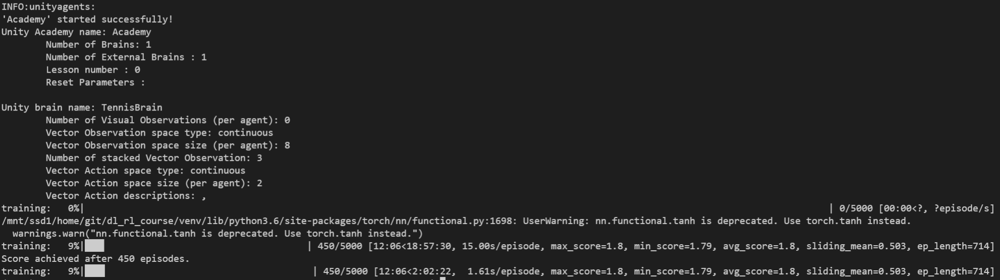

[//]: # (Image References)

[image1]: https://user-images.githubusercontent.com/10624937/42135623-e770e354-7d12-11e8-998d-29fc74429ca2.gif "Trained Agent"


# Project 3: Collaboration and Competition

![Trained Agent][image1]

Here you can find my solution to the 3rd project of the Udacity Deep RL course.
A detailed report of my solution and changes to code provided my Udacity you can find in the [Report.md](Report.md)

In this environment, two agents control rackets to bounce a ball over a net. If an agent hits the ball over the net, it receives a reward of +0.1.  If an agent lets a ball hit the ground or hits the ball out of bounds, it receives a reward of -0.01.  Thus, the goal of each agent is to keep the ball in play.

The observation space consists of 8 variables corresponding to the position and velocity of the ball and racket. Each agent receives its own, local observation.  Two continuous actions are available, corresponding to movement toward (or away from) the net, and jumping. 

The task is episodic, and in order to solve the environment, your agents must get an average score of +0.5 (over 100 consecutive episodes, after taking the maximum over both agents). Specifically,

- After each episode, we add up the rewards that each agent received (without discounting), to get a score for each agent. This yields 2 (potentially different) scores. We then take the maximum of these 2 scores.
- This yields a single **score** for each episode.

The environment is considered solved, when the average (over 100 episodes) of those **scores** is at least +0.5.

### Getting Started

1. Download the environment from one of the links below.  You need only select the environment that matches your operating system:
    - Linux: [click here](https://s3-us-west-1.amazonaws.com/udacity-drlnd/P3/Tennis/Tennis_Linux.zip)
    - Mac OSX: [click here](https://s3-us-west-1.amazonaws.com/udacity-drlnd/P3/Tennis/Tennis.app.zip)
    - Windows (32-bit): [click here](https://s3-us-west-1.amazonaws.com/udacity-drlnd/P3/Tennis/Tennis_Windows_x86.zip)
    - Windows (64-bit): [click here](https://s3-us-west-1.amazonaws.com/udacity-drlnd/P3/Tennis/Tennis_Windows_x86_64.zip)
    
    (_For Windows users_) Check out [this link](https://support.microsoft.com/en-us/help/827218/how-to-determine-whether-a-computer-is-running-a-32-bit-version-or-64) if you need help with determining if your computer is running a 32-bit version or 64-bit version of the Windows operating system.


2. Unzip (or decompress) the file.

3. Add the path of the environment to the `config.py`
- **Mac**: `PATH_TO_TENNIS = "path/to/Tennis.app"`
- **Windows** (x86): `PATH_TO_TENNIS = "path/to/Tennis_Windows_x86/Tennis.exe"`
- **Windows** (x86_64): `PATH_TO_TENNIS = "path/to/Tennis_Windows_x86_64/Tennis.exe"`
- **Linux** (x86): `PATH_TO_TENNIS = "path/to/Tennis_Linux/Tennis.x86"`
- **Linux** (x86_64): `PATH_TO_TENNIS = "path/to/Tennis_Linux/Tennis.x86_64"`
- **Linux** (x86, headless): `PATH_TO_TENNIS = "path/to/Tennis_Linux_NoVis/Tennis.x86"`
- **Linux** (x86_64, headless): `PATH_TO_TENNIS = "path/to/Tennis_Linux_NoVis/Tennis.x86_64"`

4. Create a new python virtual env with python 3.6 and activate it.

5. Install the required python packages:
```bash
    cd python
    pip install .
```

Please note this from the [Udacity Deep RL repo](https://github.com/udacity/deep-reinforcement-learning) to assure the same behavior. I just extended the requirements by `tqdm` which I use for visualization.

In case you already have an python env from the Udacity course, feel free to just
```bash
pip install tqdm
```

### Play / Inference

In this repo you find the weights for a fully trained agent in the `checkpoint.pth`.
In order to watch a game you can just start the `play.py`
```bash
python play.py
```

### Training

In order to start a new training from just execute the `train.py` script.
```bash
python train.py
```

In my case it did take 450 steps to achieve the metric:



If you install xtensorboard
```bash
pip install xtensorboard
```

you can also see all metrics in tensorboard

```bash
tensorboard --logdir runs
```


# Search for hyperparameter

If you want to search for even better hyperparameter, feel free to use (and adapt) the `search.py` script.
All you need is to install ray tune and the according bayesian optimizer.

```bash
pip install ray
pip install bayesian-optimization
```

Note: I did find the hyperparamter here by manual trial and error and did NOT use this script here.

# Code structure

Note that the following files are identical in all my Udacity projects, so I could reuse the code easier:

```
agents.py
environment.py
memory.py
model.py
training.py
```
