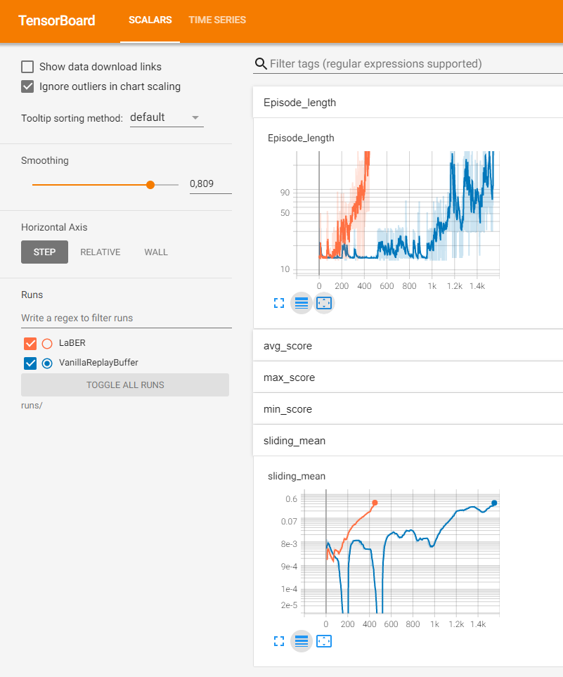

# Report for project 3: Collaboration and Competition

The goal of this project is to train a pair of agents that play together tennis. For more detailed description have a look at the [README.md](README.md). The task is solved if the sliding mean (over 100 episodes of the max value) is above 0.5.

## Learning Algorithm
In contrast to the other projects, we have now two agents in the same environment which can interact with each other. From the environment this is encoded in the batchsize, which is always 2, each element referring to one of the agents. Therefore I created a virtual agent, that takes the batched tensors and then breaks up those for each agent.

### Baseline
Next to the random behavior provided by Udacity, in my first shot for a baseline, I tried to train two independent vanilla DDPG agents:

```python
class MultiAgent(Agent):
    """An agent that just consists of multiple independent agents.

    Args:
        agents: List of agents.
    """

    def __init__(self, agents: List[Agent]) -> None:
        super().__init__()
        self.agents = agents
        self.no_agents = len(agents)  # So we dont have to query this every time

    def act(self, state):

        actions = []
        for i, agent in enumerate(self.agents):
            actions.append(agent.act(state[i]))
        return np.concatenate(actions)

    def step(self, state, action, reward, next_state, done):

        for i, agent in enumerate(self.agents):
            agent.step(
                state[i : i + 1],
                action[i : i + 1],
                reward[i : i + 1],
                next_state[i : i + 1],
                done[i : i + 1],
            )

```

At this stage the agents could not even reach 0.05 in 5000 episodes.

### Stability and convergence
Since both agents can/should behave the same way, I was thinking that having one network for the actor and critic should give stability and faster convergence.

Now the question arised, if the observation of both agent is exactly the same when facing the same situation from their perspective:
E.g. when the ball is over the net and heading to the agent, is the observation the same for the agent on the left side as for the one on the right side? Are distances relative to the agent and "mirrored"? Or do they depend on where your agent ist placed. Since I did not find anything in the docu, I assumed the more difficult situation:
The observation depends on where your agent is located.

Therefore I created an agent that extends the observation space by one dimension: Player encoding. My assumption is that the two observation spaces are symmetric to each other, thats why agent 0 gets the encoding `-1.0` and agent 1 the encoding `1.0`.
For the network it should be easy to adjust the output depending on the player dimension and at the same time we get in every step two updates from different perspective. We have also less to care about the balance which agent did learn faster then the other, since its easy to share their "knowledge".

In code this looks like this:
```python
class SpacePlayerDDPG(DDPG):
    """Encodes which players view it is in the state."""

    def __init__(
        self,
        state_size: int,
        action_size: int,
        seed: int,
        hpara: dict,
        buffer_size: int = int(1e5),
        batch_size: int = 128,
        add_noise=True,
    ):

        super().__init__(
            state_size + 1, action_size, seed, hpara, buffer_size, batch_size, add_noise
        )
        self.player_encoding = np.expand_dims(np.array([-1.0, 1.0]), axis=1)

    def act(self, state):

        state = np.concatenate([state, self.player_encoding], axis=1)

        return super().act(state)

    def step(self, state, action, reward, next_state, done):

        state = np.concatenate([state, self.player_encoding], axis=1)
        next_state = np.concatenate([next_state, self.player_encoding], axis=1)

        super().step(state, action, reward, next_state, done)
```

When testing the vanilla DDPG vs the version with player encoding I did see a huge difference: The first one barely gets any rewards after a few steps, whereas the other one beats the baseline with two single agents. Still the performance was not convincing :)


### Exploration
This was one of the biggest challenges to find out for me. When playing around with the hyperparameter often my agents did not get above an sliding mean of 0.05.
From the previous projects I added an noise level variable that fades out over iterations. By setting it up very high my training achieved better results, but still did converge early with sliding mean of ~0.02. By increasing the decay step, my trainings start to hit the task goal (sliding mean of 0.5).

I ended up with the following hyperparameters:

```python
hpara = {
    "tau": 0.01,
    "gamma": 0.99,
    "lr_actor": 1e-3,
    "lr_critic": 1e-3,
    "weight_decay_critic": 0.0,
    "noise_sigma": 1.0,
    "noise_theta": 0.15,
    "learn_every_step": 1,
    "learn_steps": 1,
    "noise_level_start": 5.00,
    "noise_level_range": 4.9,
    "noise_level_decay": 0.99, 
}
```

### Fixing(?) Ornstein-Uhlenbeck process
I did take the code for the Ornstein-Uhlenbeck process from the Udacity repo. But it seems to be wrong: The action space is in all continues environments between -1.0 and 1.0. But the noise created by the code is only between 0.0 and 1.0. 

So I changed the following line:
```python
dx = self.theta * (self.mu - x) + self.sigma * np.array(
    [random.random() for i in range(len(x))]
)
```

to

```python
dx = self.theta * (self.mu - x) + self.sigma * np.array(
    [random.uniform(-1, 1) for i in range(len(x))]
)
```
Basically I replaced `random.random()` by `random.uniform(-1, 1)`. The first one is only between 0 and 1, and the later between -1 and 1 which leads to the behavior I would expect.

### Memory
When looking at the scores every round it is obvious that most signals do not lead to a reward. So the memory could be full of experiences that dont help the training too much.

In the course "Prioritized Experience Replay" was introduced, but there was no code provided for that one. Since I would have needed to implement on my own, I was checking if there is maybe something even better nowadays. And did find a paper called: [Lahire, Thibault, Matthieu Geist, and Emmanuel Rachelson. "Large Batch Experience Replay." arXiv preprint arXiv:2110.01528 (2021).](https://arxiv.org/abs/2110.01528). Their claim seemed to be logic and implementation complexity was not too high. The basic idea of the paper is that you first sample from a big batch, evaluate this one with the critic, and sample again a smaller batch but with a prioritization based on the critic evaluation in the first step. The authors claim that this avoids the problem of outdated information which could happen in vanilla "Prioritized Experience Replay".

My implementation looks like this:

```python
class LaBER(Memory):
    """Memory with prioritization.

    Based on:
    Lahire, Thibault, Matthieu Geist, and Emmanuel Rachelson. "Large Batch Experience Replay." arXiv preprint arXiv:2110.01528 (2021).
    https://arxiv.org/abs/2110.01528

    Args:
        buffer_size: Maximum size of buffer.
        batch_size: Size of each training batch.
        seed: Random seed.
        batch_size_multiplicator: Multiple of batch_size used to define the size if the "large batch" which is used for rating.
        critic: Critic used for rating experiences in the large batch.
        cast_action_to_long: If true, the returned action tensor is casted to long (for discrete problems).
    """

    def __init__(
        self,
        buffer_size: int,
        batch_size: int,
        seed: int,
        batch_size_multiplicator: int,
        critic,
        cast_action_to_long: bool = False,
    ) -> None:

        self.batch_size = batch_size
        large_batchsize = batch_size * batch_size_multiplicator
        self.memory = ReplayBuffer(
            buffer_size, large_batchsize, seed, cast_action_to_long
        )
        self.critic = critic

    def sample(self) -> Tuple:
        states, actions, rewards, next_states, dones = self.memory.sample()

        self.critic.eval()
        with torch.no_grad():
            q_values = torch.squeeze(self.critic(states, actions))
        self.critic.train()

        # Normalize so we can use q values for sampling
        sampling_weights = q_values - torch.min(q_values)
        sampling_weights = sampling_weights / torch.sum(sampling_weights)

        idx = sampling_weights.multinomial(num_samples=self.batch_size)

        return (
            states[idx],
            actions[idx],
            rewards[idx],
            next_states[idx],
            dones[idx],
        )

```

For me it did the trick. Before I did need about 1550 episodes with a vanilla Replay Buffer. With the "LaBER" memory from the paper I could converge already in 450 episodes:



Note: As mentioned before I assume that hyperparameter, especially the noise, depend on the approach and how fast the agents learns. So maybe there is better hyperparametrization for the vanilla Replay Buffer (or for LaBER) so this difference could also be higher or lower.


## Ideas for Future Work

### NoisyNetwork
Since finding a good hyperparameter for noise did take some time, NoisyNetwork seemed to be very practical since the adapt the noise during training. I tried the implementation from this [github repo](https://github.com/thomashirtz/noisy-networks). But it did not seem to work in my case. Maybe I did something wrong?
Maybe there is some follow up research?

### Hyperparameter search
As mentioned before, my hyperparameter search was just trial and error and I assume there are even better ones.
I wrote my code in way so its very easy to run a hyperparameter search with "ray tune". Check out the `search.py`.
I did run it for a short while, but since the parameter space is already quite big and did not find any good combination.
But I assume with enough time and computing power you could find better. 

### MADDPG
The paper "Multi-Agent Actor-Critic for Mixed Cooperative-Competitive Environments" mentioned in the course sounds very interesting and would probably also be suited for more challenging environments like the soccer game.
